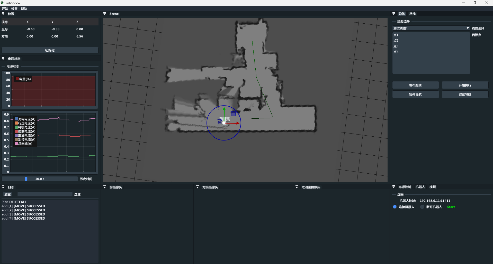

## RobotView

- Simple 3D ros host computer for windows
- You can add more features. refer to [learnopengl](https://learnopengl.com/)
- you can make a simple ros application using ros-serial. refer to [rosserial](https://wiki.ros.org/rosserial) 

## build

```shell
cd RobotView
mkdir build && cd build
cmake ..

then open the RobotView.sln
```

## Demo

simple demo base on [cartographer](https://github.com/cartographer-project/cartographer), refer to  [Cartographer 使用](https://www.icetdpl.com/posts/CartoGrapher%E4%BD%BF%E7%94%A8/)



## Thanks

- [assimp](https://github.com/assimp/assimp)
- [FFmpeg](https://github.com/FFmpeg/FFmpeg)
- [glad](https://github.com/Dav1dde/glad)
- [glfw](https://github.com/glfw/glfw)
- [imgui](https://github.com/ocornut/imgui)
- [ImGuizmo](https://github.com/CedricGuillemet/ImGuizmo)
- [implot](https://github.com/epezent/implot)
- [sqlite3](https://github.com/sqlite/sqlite)
- [stb_image](https://github.com/nothings/stb/blob/master/stb_image.h)
- [yaml-cpp](https://github.com/jbeder/yaml-cpp)
- [Walnut](https://github.com/StudioCherno/Walnut)
